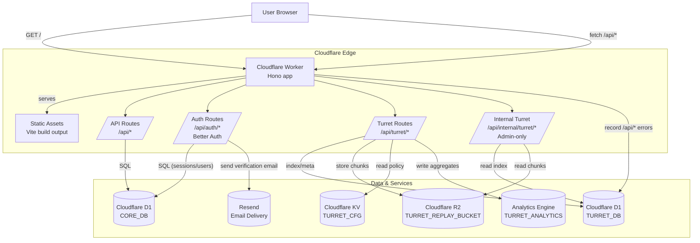

# The Stack

API-first, type-safe template for building fast, interactive apps on Cloudflare Workers.

## Features

- ☁️ **Deploy:** Ship applications instead of managing infrastructure.
- 🧩 **Validate:** End-to-end type-safe APIs with runtime schema validation.
- 📖 **Document:** Beautiful product docs and auto-generated API docs from shared schemas—always in sync.
- ⚛️ **Fetch:** Cache, refetch, and sync client data with resilient loading states.
- 🔐 **Authenticate:** Sessions, email/password, OAuth, and verification flows ready to ship.
- 📬 **Notify:** Send emails with React templates and reliable delivery.
- 🧪 **Isolate:** Keep configs, secrets, and data separate across local/dev/staging/prod.
- 👀 **Observe:** Turret (session replay first, errors next), plus logs, traces, and metrics to find and fix issues fast.

## Built with

- [TypeScript](https://www.typescriptlang.org/) for programming language
- [React](https://react.dev/) for UI components
- [Tailwind CSS](https://tailwindcss.com/) for CSS framework
- [shadcn](https://ui.shadcn.com/) for component library
- [TanStack Query](https://tanstack.com/query/latest) for async state management
- [TanStack Router](https://tanstack.com/router/latest) for routing
- [Hono](https://hono.dev/) for web framework
- [Better Auth](https://www.better-auth.com/) for auth framework
- [Zod](https://zod.dev/) for schema validation
- [Astro](https://astro.build/) for marketing + product docs
- [Scalar](https://scalar.com/) for API docs
- [Cloudflare Workers](https://workers.cloudflare.com/) for compute
- [D1](https://developers.cloudflare.com/d1/) for database
- [R2](https://developers.cloudflare.com/r2/) for object storage
- [Analytics Engine](https://developers.cloudflare.com/analytics/analytics-engine/) for aggregated event metrics
- [KV](https://developers.cloudflare.com/kv/) for low-latency config
- [Turnstile](https://www.cloudflare.com/application-services/products/turnstile/) for CAPTCHA alternative
- [Drizzle](https://orm.drizzle.team/) for ORM
- [Turret](/docs/turret.md) for observability framework
- [Resend](https://resend.com/) for email deliverability service (TODO: [Cloudflare Email Service](https://blog.cloudflare.com/email-service/))
- [React Email](https://react.email/) for email components
- [Vitest](https://vitest.dev/) for testing framework
- [Playwright](https://playwright.dev/) for end-to-end tests
- [Prettier](https://prettier.io/) for formatting
- [ESLint](https://eslint.org/) for linting
- [opencode](https://opencode.ai/) for AI coding agent
    - [Cloudflare Skill](https://github.com/dmmulroy/cloudflare-skill) for Cloudflare platform reference docs

## Content & docs

This repo ships three user-facing surfaces from the same Cloudflare Worker deployment:

- Marketing site at `/` (Astro, prerendered by default)
- Product documentation at `/docs/*` (Astro + Content Collections from `src/content/docs`)
- API documentation at `/api/scalar` (Scalar UI) with OpenAPI JSON at `/api/doc`

## System diagram



## Turret (Built-in Observability)

Turret is The Stack's built-in observability platform (session replay + errors).

See `docs/turret.md`.

## Getting started

Install dependencies:

```bash
npm install
```

Generate a Better Auth secret:

```bash
npx @better-auth/cli@latest secret
```

Set local secrets/vars:

```bash
cp .dev.vars.example .dev.vars
```

Then edit `.dev.vars` and set at least:

- `BETTER_AUTH_SECRET`
- `APP_URL` (used for email links)
- `ADMIN_EMAIL` (used by the local admin bootstrap script)

Optional:

- `BOOTSTRAP_SECRET` (only needed for the `/api/internal/bootstrap-admin` endpoint)

Optional (required only if you enable Turret ingestion locally):

- `TURRET_SIGNING_KEY` (signs Turret upload tokens)

Emails are log-only by default in local. Set `RESEND_API_KEY` in `.dev.vars` if you want to send real emails.

Run local D1 migrations (includes Better Auth tables):

```bash
npm run db:core:migrate:local
```

Optional: run local Turret migrations (session replay index tables):

```bash
npm run db:turret:migrate:local
```

Open Drizzle Studio (local):

```bash
npm run db:core:studio:local
npm run db:turret:studio:local
```

Run the app locally:

```bash
npm run dev
```

Create the initial local admin user (recommended):

```bash
npm run admin:create:local
```

- Creates (or promotes) `ADMIN_EMAIL` to admin in local `CORE_DB`
- Generates a random password only if needed, prints it once, and saves it to `.wrangler/.admin-password`
- Re-running is idempotent: if the admin already has a credential password, it will not rotate or print it again

Alternative: bootstrap via HTTP endpoint (triggers a password reset link, requires `BOOTSTRAP_SECRET`):

```bash
curl -X POST "http://localhost:5173/api/internal/bootstrap-admin" \
  -H "x-bootstrap-secret: <BOOTSTRAP_SECRET>"
```

Then open the logged reset link and set your password.

> [!NOTE]
> Highly recommend installing [opencode](https://opencode.ai/) and the [Cloudflare Skill for OpenCode](https://github.com/dmmulroy/cloudflare-skill)

## Production Deployment

This repo deploys a single production Worker.

- Worker name: `the-stack-production` (`--env production`)

Notes:

- `wrangler.json` is the source of truth.
- Bindings (KV, D1, R2, Durable Objects, Queues, etc.) are not inherited between environments. This repo configures both local defaults and `env.production` explicitly.

### Production config

Before your first deploy, edit `wrangler.json` and set:

- `env.production.vars.APP_URL` (your public origin, no trailing slash)
- `env.production.vars.ADMIN_EMAIL` (where bootstrap/reset emails are sent)

Then set these secrets:

```bash
wrangler secret put BETTER_AUTH_SECRET --env production
wrangler secret put BOOTSTRAP_SECRET --env production
wrangler secret put RESEND_API_KEY --env production

# Turret (required if using Turret ingestion)
wrangler secret put TURRET_SIGNING_KEY --env production
```

If `RESEND_API_KEY` is not set, the Worker will log emails instead of sending them.

## Database (D1)

This repo uses two D1 databases:

- `core-production` (auth + app data)
- `turret-production` (Turret: session replay index + events)

Create the databases (once):

```bash
wrangler d1 create core-production
wrangler d1 create turret-production
```

Then replace the placeholder `database_id` values for `CORE_DB` and `TURRET_DB` in `wrangler.json` with the UUIDs returned by the commands.

Apply migrations locally:

```bash
npm run db:core:migrate:local
```

Apply migrations in production:

```bash
wrangler d1 migrations apply CORE_DB --env production
wrangler d1 migrations apply TURRET_DB --env production
```

## Deploy

Production deploy:

```bash
npm run deploy:production
```

After the first deploy, bootstrap the initial admin user (sends a password reset email to `ADMIN_EMAIL`):

```bash
curl -X POST "https://<your-domain>/api/internal/bootstrap-admin" \
  -H "x-bootstrap-secret: <BOOTSTRAP_SECRET>"
```

`npm run deploy` intentionally fails to prevent accidental deploys.

## Logs

Tail production logs:

```bash
npx wrangler tail --env production
```

## Gotchas

- Re-run `npm run cf-typegen` after changing `wrangler.json` bindings.
- When you run the development server (`npm run dev`), the necessary route configuration and TypeScript types are automatically generated and updated in a file like `routeTree.gen.ts`.
- Better Auth schema changes (eg. adding plugins) should be reflected in `src/bindings/d1/core/schema/better-auth.ts`, then migrated:

```bash
npm run db:core:generate -- --name <your_migration_name>
wrangler d1 migrations apply CORE_DB --env production
```
