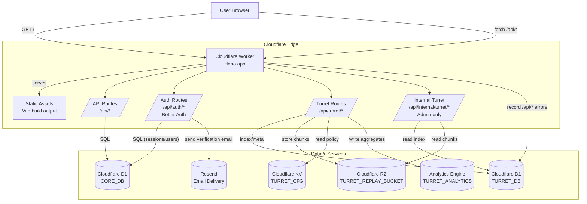

# The Stack

API-first, type-safe template for building fast, interactive apps on Cloudflare Workers.

## Features

- ☁️ **Deploy:** Ship applications instead of managing infrastructure.
- 🧩 **Validate:** End-to-end type-safe APIs with runtime schema validation.
- 📖 **Document:** Beautiful product docs and auto-generated API docs from shared schemas—always in sync.
- ⚛️ **Fetch:** Cache, refetch, and sync client data with resilient loading states.
- 🔐 **Authenticate:** Sessions, email/password, OAuth, and verification flows ready to ship.
- 📬 **Notify:** Send emails with React templates and reliable delivery.
- 🧪 **Isolate:** Keep configs, secrets, and data separate across local/dev/staging/prod.
- 👀 **Observe:** Turret (session replay first, errors next), plus logs, traces, and metrics to find and fix issues fast.

## Roadmap

- See `docs/ROADMAP.md` for priorities and execution phases.
- See `CONTRIBUTING.md` for local workflow and PR expectations.

## Built with

- [TypeScript](https://www.typescriptlang.org/) for programming language
- [React](https://react.dev/) for UI components
- [Tailwind CSS](https://tailwindcss.com/) for CSS framework
- [shadcn](https://ui.shadcn.com/) for component library
- [TanStack Query](https://tanstack.com/query/latest) for async state management
- [TanStack Router](https://tanstack.com/router/latest) for routing
- [Hono](https://hono.dev/) for web framework
- [Better Auth](https://www.better-auth.com/) for auth framework
- [Zod](https://zod.dev/) for schema validation
- [Astro](https://astro.build/) for marketing + product docs
- [Scalar](https://scalar.com/) for API docs
- [Cloudflare Workers](https://workers.cloudflare.com/) for compute
- [D1](https://developers.cloudflare.com/d1/) for database
- [R2](https://developers.cloudflare.com/r2/) for object storage
- [Analytics Engine](https://developers.cloudflare.com/analytics/analytics-engine/) for aggregated event metrics
- [KV](https://developers.cloudflare.com/kv/) for low-latency config
- [Turnstile](https://www.cloudflare.com/application-services/products/turnstile/) for CAPTCHA alternative
- [Drizzle](https://orm.drizzle.team/) for ORM
- [Turret](/docs/turret.md) for observability framework
- [Resend](https://resend.com/) for email deliverability service (TODO: [Cloudflare Email Service](https://blog.cloudflare.com/email-service/))
- [React Email](https://react.email/) for email components
- [Vitest](https://vitest.dev/) for testing framework
- [Playwright](https://playwright.dev/) for end-to-end tests
- [Oxfmt](https://oxc.rs/docs/guide/usage/formatter.html) for formatting
- [ESLint](https://eslint.org/) for linting
- [opencode](https://opencode.ai/) for AI coding agent
    - [Cloudflare Skill](https://github.com/dmmulroy/cloudflare-skill) for Cloudflare platform reference docs

## Content & docs

This repo ships three user-facing surfaces from the same Cloudflare Worker deployment:

- Marketing site at `/` (Astro, prerendered by default)
- Product documentation at `/docs/*` (Astro + Content Collections from `src/content/docs`)
- API documentation at `/api/scalar` (Scalar UI) with OpenAPI JSON at `/api/doc`

Docs are organized into tracks:

- Build: local setup, auth, DB
- Operate: deploy, verify, rollback
- Extend: feature scaffolding and guardrails

## System diagram


```mermaid
flowchart TB
  %% The Stack (Cloudflare Workers) - System Diagram

  U[User Browser]

  subgraph CF[Cloudflare Edge]
    W[Cloudflare Worker<br/>Hono app]
    A[Static Assets<br/>Vite build output]
    API[/API Routes<br/>/api/*/]
    AUTH[/Auth Routes<br/>/api/auth/*<br/>Better Auth/]
    TUR[/Turret Routes<br/>/api/turret/*/]
    TINT[/Internal Turret<br/>/api/internal/turret/*<br/>Admin-only/]
  end

  subgraph DATA[Data & Services]
    D1[(Cloudflare D1<br/>CORE_DB)]
    TDB[(Cloudflare D1<br/>TURRET_DB)]
    TR2[(Cloudflare R2<br/>TURRET_REPLAY_BUCKET)]
    TKV[(Cloudflare KV<br/>TURRET_CFG)]
    TAE[(Analytics Engine<br/>TURRET_ANALYTICS)]
    RESEND[(Resend<br/>Email Delivery)]
  end

  U -->|"GET /"| W
  W -->|"serves"| A

  U -->|"fetch /api/*"| W
  W --> API
  W --> AUTH
  W --> TUR
  W --> TINT

  API -->|"SQL"| D1
  AUTH -->|"SQL (sessions/users)"| D1

  %% Turret ingestion + playback
  TUR -->|"index/meta"| TDB
  TUR -->|"store chunks"| TR2
  TUR -->|"read policy"| TKV
  TUR -->|"write aggregates"| TAE
  TINT -->|"read index"| TDB
  TINT -->|"read chunks"| TR2

  W -->|"record /api/* errors"| TDB
  AUTH -->|"send verification email"| RESEND
```

## Turret (Built-in Observability)

Turret is The Stack's built-in observability platform (session replay + errors).

See `docs/turret.md`.

## Getting started

### 10-minute quickstart (golden path)

Use this exact flow for a first local run.

Prerequisites:

- Node.js 22+
- npm
- `just`

Install `just`:

```bash
# macOS
brew install just

# Linux
cargo install just
```

Copy-paste setup:

```bash
cp .dev.vars.example .dev.vars

# Set these values in .dev.vars before continuing:
# BETTER_AUTH_SECRET="<paste output of: just secret-auth>"
# APP_URL="http://localhost:4321"
# ADMIN_EMAIL="you@example.com"

just setup
just dev
```

In another terminal, verify the golden-path endpoints:

```bash
curl -i "http://localhost:4321/"
curl -i "http://localhost:4321/docs"
curl -i "http://localhost:4321/app"
curl -i "http://localhost:4321/api/health"
curl -i "http://localhost:4321/api/scalar"
```

Expected results:

- `just setup` ends with `Local setup complete.` and no `FAIL` lines.
- `just dev` starts the server on `http://localhost:4321`.
- `/api/health` returns `200` with JSON containing `"ok": true`.
- `/api/scalar` returns `200` and loads API docs.

Quick troubleshooting:

| Symptom                                       | Likely cause                | Fix                                                               |
| --------------------------------------------- | --------------------------- | ----------------------------------------------------------------- |
| `Missing required values` during `just setup` | `.dev.vars` not filled      | Set `BETTER_AUTH_SECRET`, `APP_URL`, `ADMIN_EMAIL` in `.dev.vars` |
| `Wrangler not available` in doctor output     | dependencies not installed  | Run `npm install` then `just doctor`                              |
| `Could not find a local D1 sqlite file`       | migrations not applied yet  | Run `just migrate-core` and `just migrate-turret`                 |
| Login works but no account exists             | invite-only mode is default | Run `just admin-create` or set `AUTH_SIGNUP_MODE=open`            |

### Detailed setup and commands

Install `just` (required):

```bash
# macOS
brew install just

# Linux
cargo install just
```

Show available tasks:

```bash
just
```

Generate a Better Auth secret:

```bash
just secret-auth
```

Set local secrets/vars:

```bash
cp .dev.vars.example .dev.vars
```

Bootstrap local dev (install, migrations, admin bootstrap):

```bash
just setup
```

Then edit `.dev.vars` and set at least:

- `BETTER_AUTH_SECRET`
- `APP_URL` (used for email links)
- `ADMIN_EMAIL` (used by the local admin bootstrap script)

For local, set `APP_URL` to `http://localhost:4321`.

Optional:

- `BOOTSTRAP_SECRET` (only needed for the `/api/internal/bootstrap-admin` endpoint)
- `AUTH_SIGNUP_MODE` (`invite_only` default, set `open` to allow public sign-up)

Optional (required only if you enable Turret ingestion locally):

- `TURRET_SIGNING_KEY` (signs Turret upload tokens)

Emails are log-only by default in local. Set `RESEND_API_KEY` in `.dev.vars` if you want to send real emails.

Run local D1 migrations manually (if needed):

```bash
just migrate-core
```

Or run setup script directly:

```bash
just setup
```

Health-check your local setup at any time:

```bash
just doctor
just status
```

Reset local DB state and rebuild from migrations:

```bash
just reset
```

Seed local demo records for faster internal testing:

```bash
just seed
```

Optional: run local Turret migrations (session replay index tables):

```bash
just migrate-turret
```

Open Drizzle Studio (local):

```bash
just studio-core
just studio-turret
```

Run the app locally:

```bash
just dev
```

Create the initial local admin user (if you did not run `just setup`):

```bash
just admin-create
```

- Creates (or promotes) `ADMIN_EMAIL` to admin in local `CORE_DB`
- Generates a random password only if needed, prints it once, and saves it to `.wrangler/.admin-password`
- Re-running is idempotent: if the admin already has a credential password, it will not rotate or print it again

Alternative: bootstrap via HTTP endpoint (triggers a password reset link, requires `BOOTSTRAP_SECRET`):

```bash
curl -X POST "http://localhost:4321/api/internal/bootstrap-admin" \
  -H "x-bootstrap-secret: <BOOTSTRAP_SECRET>"
```

Note: self-service sign-up is disabled by default (`AUTH_SIGNUP_MODE=invite_only`). Use local admin bootstrap.
Set `AUTH_SIGNUP_MODE=open` only if you explicitly want public self-service sign-up.

Then open the logged reset link and set your password.

> [!NOTE]
> Highly recommend installing [opencode](https://opencode.ai/) and the [Cloudflare Skill for OpenCode](https://github.com/dmmulroy/cloudflare-skill)

## Production Deployment

This repo deploys a single production worker.

- Worker name: `the-stack-production` (`wrangler.json`)

Notes:

- `wrangler.json` is the source of truth.
- Bindings (KV, D1, R2, Durable Objects, Queues, etc.) are not inherited between environments. This repo configures both local defaults and `env.production` explicitly.

### Production config

Before your first deploy, edit `wrangler.json` and set:

- `env.production.vars.APP_URL` (your public origin, no trailing slash)
- `env.production.vars.ADMIN_EMAIL` (where bootstrap/reset emails are sent)

Then set these secrets:

```bash
wrangler secret put BETTER_AUTH_SECRET --env production
wrangler secret put BOOTSTRAP_SECRET --env production
wrangler secret put RESEND_API_KEY --env production

# Turret (required if using Turret ingestion)
wrangler secret put TURRET_SIGNING_KEY --env production
```

If `RESEND_API_KEY` is not set, the Worker will log emails instead of sending them.

Turret mode:

- `TURRET_MODE=full` (default): full ingest when signing key exists
- `TURRET_MODE=basic`: no ingest, admin/read surfaces remain
- `TURRET_MODE=off`: ingest disabled

## Database (D1)

This repo uses two D1 databases:

- `core-production` (auth + app data)
- `turret-production` (Turret: session replay index + events)

Create the databases (once):

```bash
wrangler d1 create core-production
wrangler d1 create turret-production
```

Then replace the placeholder `database_id` values for `CORE_DB` and `TURRET_DB` in `wrangler.json` with the UUIDs returned by the commands.

Apply migrations locally:

```bash
just migrate-core
```

Apply migrations in production:

```bash
wrangler d1 migrations apply CORE_DB --env production
wrangler d1 migrations apply TURRET_DB --env production
```

## Deploy

Production deploy:

```bash
just deploy-production
```

Verify deployment:

```bash
curl -i "https://<your-domain>/api/health"
curl -i "https://<your-domain>/api/scalar"
```

After the first deploy, bootstrap the initial admin user (sends a password reset email to `ADMIN_EMAIL`):

```bash
curl -X POST "https://<your-domain>/api/internal/bootstrap-admin" \
  -H "x-bootstrap-secret: <BOOTSTRAP_SECRET>"
```

`npm run deploy` intentionally fails to prevent accidental deploys. Use `just deploy-production` for explicit production deploys.

## Logs

Tail production logs:

```bash
npx wrangler tail --env production
```

Or use `just logs`.

## Internal Velocity Commands

Fast local checks while iterating:

```bash
just check-fast
```

Full validation (used on main/nightly):

```bash
just check-full
```

Scaffold a new API route and wire it into `src/worker/api/index.ts`:

```bash
just new-api billing-status
```

Scaffold a new TanStack route file under `src/react-app/routes`:

```bash
just new-route _public/reports
```

Production deploy preflight (Go/No-Go):

```bash
just preflight
```

## Gotchas

- Re-run `just cf-typegen` after changing `wrangler.json` bindings.
- When you run the development server (`just dev`), the necessary route configuration and TypeScript types are automatically generated and updated in a file like `routeTree.gen.ts`.
- Better Auth schema changes (eg. adding plugins) should be reflected in `src/bindings/d1/core/schema/better-auth.ts`, then migrated:

```bash
just db-generate-core <your_migration_name>
wrangler d1 migrations apply CORE_DB --env production
```
