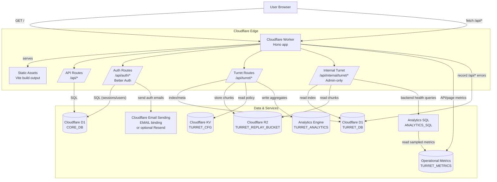

# The Stack

API-first, type-safe template for building fast, interactive apps on Cloudflare Workers.

Start locally with Node.js 22.22.1+ and pnpm 10.34.6 (see [Getting Started](src/content/docs/v1/welcome.md) for installation):

```bash
pnpm install
pnpm local:setup
pnpm dev
```

Setup creates `.dev.vars`, initializes a local auth secret, applies both local D1
migration chains, and creates a verified administrator. It preserves existing
settings, records, and credentials on rerun. No Cloudflare account or external
service credentials are needed locally.

Open <http://localhost:4321/app/organizations> and sign in with the email and
password saved in `.wrangler/.admin-password`. Create an organization, open it,
then select **Projects** and create your first record.

Next, follow [Build your first feature](src/content/docs/v1/first-feature.md) to
add a persisted project status through the database, typed API, and React form.
Organizations and permissions are core capabilities; Projects is a small,
replaceable example. The [extension reference](src/content/docs/v1/extend.md)
explains the architecture and boundaries.

## Features

- ☁️ **Deploy:** Ship applications instead of managing infrastructure.
- 🧩 **Validate:** End-to-end type-safe APIs with runtime schema validation.
- 📖 **Document:** Beautiful product docs and auto-generated API docs from shared schemas—always in sync.
- ⚛️ **Fetch:** Cache, refetch, and sync client data with resilient loading states.
- 🔐 **Authenticate:** Sessions, email/password, OAuth, and verification flows ready to ship.
- 📬 **Notify:** Send emails with React templates and reliable delivery.
- 👥 **Collaborate:** Organizations, invitations, and owner/editor/viewer permissions.
- 🧪 **Isolate:** Keep configs, secrets, and data separate across local/dev/staging/prod.
- 👀 **Observe:** Turret replay and errors, correlated logs and traces, and an admin backend health dashboard.

## Project guides

- [Contributing](CONTRIBUTING.md): local workflow and PR expectations
- [Security](SECURITY.md): vulnerability reporting
- [License](LICENSE): usage terms

## Built with

- [TypeScript](https://www.typescriptlang.org/) for programming language
- [React](https://react.dev/) for UI components
- [Tailwind CSS](https://tailwindcss.com/) for CSS framework
- [shadcn](https://ui.shadcn.com/) for component library
- [TanStack Query](https://tanstack.com/query/latest) for async state management
- [TanStack Router](https://tanstack.com/router/latest) for routing
- [Hono](https://hono.dev/) for web framework
- [Better Auth](https://www.better-auth.com/) for auth framework
- [Zod](https://zod.dev/) for schema validation
- [Astro](https://astro.build/) for marketing + product docs
- [Scalar](https://scalar.com/) for API docs
- [Cloudflare Workers](https://workers.cloudflare.com/) for compute
- [D1](https://developers.cloudflare.com/d1/) for database
- [R2](https://developers.cloudflare.com/r2/) for object storage
- [Analytics Engine](https://developers.cloudflare.com/analytics/analytics-engine/) for aggregated event metrics
- [KV](https://developers.cloudflare.com/kv/) for low-latency config
- [Turnstile](https://www.cloudflare.com/application-services/products/turnstile/) for CAPTCHA alternative
- [Drizzle](https://orm.drizzle.team/) for ORM
- [Turret](/docs/turret.md) for observability framework
- [Cloudflare Email Service](https://developers.cloudflare.com/email-service/) for native transactional email
- [Resend](https://resend.com/) as an optional email transport
- [React Email](https://react.email/) for email components
- [Node.js test runner](https://nodejs.org/api/test.html) + [tsx](https://tsx.is/) for tests
- [Playwright](https://playwright.dev/) for end-to-end tests
- [Oxfmt](https://oxc.rs/docs/guide/usage/formatter.html) for formatting (`pnpm run format`, `pnpm run format:check`)
- [Oxlint](https://oxc.rs/docs/guide/usage/linter) for linting (`pnpm run lint`)
- [opencode](https://opencode.ai/) for AI coding agent
    - [Cloudflare Skill](https://github.com/dmmulroy/cloudflare-skill) for Cloudflare platform reference docs

## Content & docs

This repo ships three user-facing surfaces from the same Cloudflare Worker deployment:

- Marketing site at `/` (Astro, prerendered by default)
- Product documentation at `/docs/*` (Astro + Content Collections from `src/content/docs`)
- API documentation at `/api/scalar` (Scalar UI) with OpenAPI JSON at `/api/doc`

Docs are organized into tracks:

- Build: local setup, auth, DB
- Operate: deploy, verify, rollback
- Extend: feature scaffolding and guardrails

## System diagram


```mermaid
flowchart TB
  %% The Stack (Cloudflare Workers) - System Diagram

  U[User Browser]

  subgraph CF[Cloudflare Edge]
    W[Cloudflare Worker<br/>Hono app]
    A[Static Assets<br/>Vite build output]
    API[/API Routes<br/>/api/*/]
    AUTH[/Auth Routes<br/>/api/auth/*<br/>Better Auth/]
    TUR[/Turret Routes<br/>/api/turret/*/]
    TINT[/Internal Turret<br/>/api/internal/turret/*<br/>Admin-only/]
  end

  subgraph DATA[Data & Services]
    D1[(Cloudflare D1<br/>CORE_DB)]
    TDB[(Cloudflare D1<br/>TURRET_DB)]
    TR2[(Cloudflare R2<br/>TURRET_REPLAY_BUCKET)]
    TKV[(Cloudflare KV<br/>TURRET_CFG)]
    TAE[(Analytics Engine<br/>TURRET_ANALYTICS)]
    TMET[(Operational Metrics<br/>TURRET_METRICS)]
    ASQL[Analytics SQL<br/>ANALYTICS_SQL]
    EMAIL[Cloudflare Email Sending<br/>EMAIL binding<br/>or optional Resend]
  end

  U -->|"GET /"| W
  W -->|"serves"| A

  U -->|"fetch /api/*"| W
  W --> API
  W --> AUTH
  W --> TUR
  W --> TINT

  API -->|"SQL"| D1
  AUTH -->|"SQL (sessions/users)"| D1

  %% Turret ingestion + playback
  TUR -->|"index/meta"| TDB
  TUR -->|"store chunks"| TR2
  TUR -->|"read policy"| TKV
  TUR -->|"write aggregates"| TAE
  TINT -->|"read index"| TDB
  TINT -->|"read chunks"| TR2
  TINT -->|"backend health queries"| ASQL
  ASQL -->|"read sampled metrics"| TMET
  W -->|"API/page metrics"| TMET

  W -->|"record /api/* errors"| TDB
  AUTH -->|"send auth emails"| EMAIL
```

## Turret (Built-in Observability)

Turret combines session replay, error monitoring, correlated request logs, native Workers traces, and operational metrics. The admin dashboard shows complete hourly replay totals plus sampled request volume, server errors, latency, and route/deployment context.

- [Turret architecture and behavior](docs/turret.md)
- [Observability setup and operations](docs/observability-operations.md): included defaults, account setup, SQL recipes, alerts, domain tracing, and retention

Local replay totals use local D1. Backend health queries require the deployed production Analytics SQL binding and display unavailable locally. Configure dashboards, alert destinations, domain tracing, and exports for each project using the operations checklist.

## Getting started

[Getting Started](src/content/docs/v1/welcome.md) is the complete local setup and
first-record walkthrough. [Build your first feature](src/content/docs/v1/first-feature.md)
continues with a concrete, end-to-end change.

Useful local commands:

```bash
pnpm doctor
pnpm status
pnpm exec wrangler d1 migrations apply CORE_DB --local
pnpm exec wrangler d1 migrations apply TURRET_DB --local
```

Local non-sensitive defaults, including `APP_URL` and `ADMIN_EMAIL`, live in
`wrangler.json` vars. Edit `.dev.vars` to override them before setup. Email is
log-only locally; auth links appear in the dev terminal. Public signup is disabled
by default; sign in with the setup administrator or use an organization invitation.

`just` is an optional shortcut for maintenance tasks. Install it with
`brew install just` on macOS or `cargo install just` on Linux, then run `just` to
list recipes. `just setup` installs dependencies and runs `pnpm local:setup`;
`just dev` runs `pnpm dev`. Deployment recipes below use `just`.

## Production Deployment

This repo deploys a single production worker.

- Worker name: `the-stack-production` (`wrangler.json`)

Notes:

- `wrangler.json` is the source of truth.
- Bindings (KV, D1, R2, Durable Objects, Queues, etc.) are not inherited between environments. This repo configures both local defaults and `env.production` explicitly.

### Production config

Before your first deploy, edit `wrangler.json` and set:

- `env.production.vars.APP_URL` (your public origin, no trailing slash)
- `env.production.vars.ADMIN_EMAIL` (where bootstrap/reset emails are sent)
- `env.production.vars.EMAIL_FROM` (mailbox on your onboarded sending domain)
- `env.production.vars.EMAIL_FROM_NAME` (your product name)

Complete [email provider setup](docs/email.md) before enabling verification/password-reset flows. The Cloudflare transport uses the production `EMAIL` binding and requires no email API-key secret.

Then set these secrets:

```bash
wrangler secret put BETTER_AUTH_SECRET --env production
wrangler secret put BOOTSTRAP_SECRET --env production

# Turret (required if using Turret ingestion)
wrangler secret put TURRET_SIGNING_KEY --env production
```

To use Resend instead, explicitly select `EMAIL_TRANSPORT=resend` and set `RESEND_API_KEY`. Missing production email configuration is reported as a failure; log-only mode is limited to local/dev/test.

Turret mode:

- `TURRET_MODE=full` (default): full ingest when signing key exists
- `TURRET_MODE=basic`: no ingest, admin/read surfaces remain
- `TURRET_MODE=off`: ingest disabled

## Database (D1)

This repo uses two D1 databases:

- `core-production` (auth + app data)
- `turret-production` (Turret: session replay index + events)

Create the databases (once):

```bash
wrangler d1 create core-production
wrangler d1 create turret-production
```

Then replace the placeholder `database_id` values for `CORE_DB` and `TURRET_DB` in `wrangler.json` with the UUIDs returned by the commands.

Apply migrations locally:

```bash
just migrate-core
```

Apply migrations in production:

```bash
wrangler d1 migrations apply CORE_DB --env production
wrangler d1 migrations apply TURRET_DB --env production
```

## Deploy

Production deploy:

```bash
just deploy-production
```

Verify deployment:

```bash
curl -i "https://<your-domain>/api/health"
curl -i "https://<your-domain>/api/scalar"
```

Complete the [per-project observability checks](docs/observability-operations.md#per-project-acceptance-checklist) to verify telemetry, backend health, and any account alerts or exports.

After the first deploy, bootstrap the initial admin user (sends a password reset email to `ADMIN_EMAIL`):

```bash
curl -X POST "https://<your-domain>/api/internal/bootstrap-admin" \
  -H "x-bootstrap-secret: <BOOTSTRAP_SECRET>"
```

`pnpm run deploy` intentionally fails to prevent accidental deploys. Use `just deploy-production` for explicit production deploys.

## Logs

Tail production logs:

```bash
pnpm exec wrangler tail --env production
```

Or use `just logs`.

## Internal Velocity Commands

Fast local checks while iterating:

```bash
just check-fast
```

Full validation (used on main/nightly):

```bash
just check-full
```

Scaffold a new TanStack route file under `src/react-app/routes`:

```bash
just new-route _public/reports
```

Production deploy preflight (Go/No-Go):

```bash
just preflight
```

## Gotchas

- Re-run `just cf-typegen` after changing `wrangler.json` bindings.
- When you run the development server (`just dev`), the necessary route configuration and TypeScript types are automatically generated and updated in a file like `routeTree.gen.ts`.
- Better Auth schema changes (eg. adding plugins) should be reflected in `src/bindings/d1/core/schema/better-auth.ts`, then migrated:

```bash
just db-generate-core <your_migration_name>
wrangler d1 migrations apply CORE_DB --env production
```
